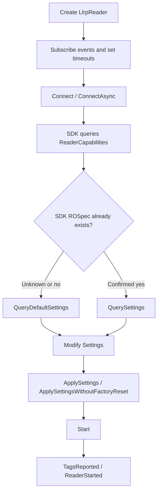
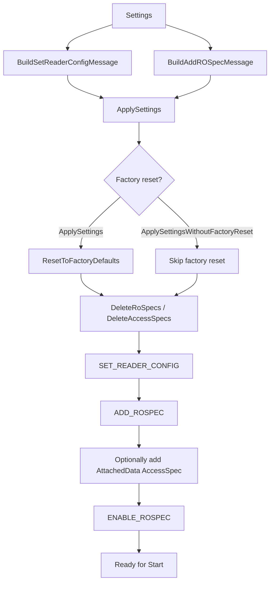
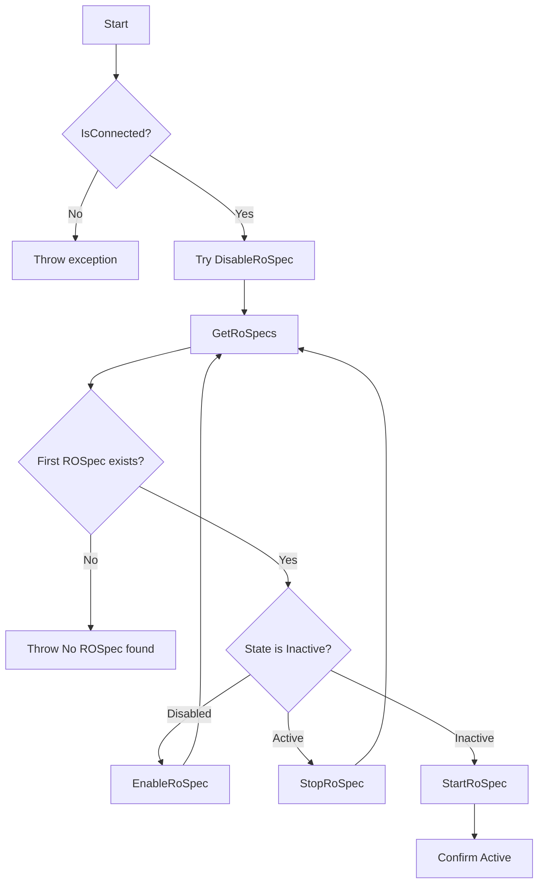

# LLRPSdk Developer Guide

## 1. Overview
`LLRPSdk` is the .NET SDK wrapper in this repository for LLRP 1.0.1 RFID readers. It targets `net9.0`. The main entry point is `LlrpReader`, which builds on the `LTKNet\LLRP` protocol library and exposes reader connection, settings, inventory, tag access, GPIO, events, and diagnostics.

Repository layers:

- `LTKNet\LLRP`: LLRP message model, encoding/decoding, TCP/TLS transport.
- `LLRPSdk`: business-oriented wrapper over standard LLRP capabilities; callers usually do not need to work with raw LTKNet messages.
- `LLRPReaderUI_WPF` / `LLRPReaderUI_Avalonia` / `LLRPReaderManagement`: UI and management examples built on the SDK.

The SDK focuses on standard LLRP messages. The repository README records validation with Impinj R700 and Zebra FX9600. Reader-specific LLRP behavior can vary, so production code should use `ReaderCapabilities` before enabling optional features.

## 2. Project Reference and Dependencies
`LLRPSdk.csproj` references the in-repository LTKNet project:

```xml
<ProjectReference Include="..\LTKNet\LLRP\LLRP-LTKNet.csproj" />
```

Application projects can reference the `LLRPSdk` project directly or reference the compiled `LLRPSdk.dll` and its dependencies.

Basic namespace:

```csharp
using LLRPSdk;
```

Default port convention:

- Non-TLS: `5084`
- TLS: `5085`
- `Connect(address, useTLS)` / `ConnectAsync(address, useTLS)` choose the default port from `useTLS`.

## 3. LlrpReader Lifecycle
### 3.1 Create and Connect
`LlrpReader` supports an empty constructor and `LlrpReader(string address, string name)`. `Address` is read-only to callers and is normally set by calling `Connect(...)`.

```csharp
var reader = new LlrpReader
{
    ConnectTimeout = 5000,
    MessageTimeout = 5000,
    MaxConnectionAttempts = 1,
    LlrpMessageLogAsXml = false
};

reader.Connect("192.168.1.100");
```

Common connection methods:

- `Connect()`: connect using the address already stored on the instance.
- `Connect(string address)`: connect to default non-TLS port `5084`.
- `Connect(string address, int port)`: connect to a specific non-TLS port.
- `Connect(string address, bool useTLS)`: use `5084` or `5085` based on TLS.
- `Connect(string address, int port, bool useTLS)`: specify port and TLS.
- `Connect(string address, int port, bool useTLS, TlsProtocols tlsProtocol)`: specify TLS protocol.
- `ConnectAsync(...)`: asynchronous connection; handle `ConnectAsyncComplete` for the result.

After a successful connection, the SDK queries and fills `ReaderCapabilities`. Note that `Connect()` only establishes the connection and queries capabilities. It does not create a ROSpec and does not automatically apply inventory settings. `Start()` depends on an SDK-compatible ROSpec already existing on the reader; if the reader has just been factory-reset, cleared with `ClearSettings()`, or has never been configured by this SDK, calling `Start()` directly fails because no ROSpec is available.

The recommended first-time initialization flow is: connect, call `QueryDefaultSettings()` to build SDK defaults from `ReaderCapabilities`, modify business settings, then call `ApplySettings(settings)`. `ApplySettings` sends `SET_READER_CONFIG`, `ADD_ROSPEC`, and `ENABLE_ROSPEC`. After that, call `Start()`.



Minimal initialization example:

```csharp
reader.Connect("192.168.1.100");

var settings = reader.QueryDefaultSettings();
settings.Report.Mode = ReportMode.Individual;
settings.Report.IncludeAntennaPortNumber = true;
settings.Report.IncludePeakRssi = true;

reader.ApplySettings(settings);
reader.Start();
```

If you want to read and reuse the reader's existing configuration, call `QuerySettings()`, but it requires an SDK-compatible ROSpec to already exist on the reader. For a new reader or a reader whose configuration has been cleared, start with `QueryDefaultSettings()` or `ApplyDefaultSettings()`, not `QuerySettings()`.

### 3.2 Settings and ROSpec Lifecycle
The SDK turns `Settings` into two categories of LLRP configuration:

- `BuildSetReaderConfigMessage(settings)`: builds reader configuration such as keepalive, GPIO, and event notifications.
- `BuildAddROSpecMessage(settings)`: builds the SDK ROSpec with the SDK's fixed internal ROSpec ID.
- `ApplySettings(settings)`: factory-resets the reader, deletes old ROSpecs and AccessSpecs, sends ReaderConfig, adds ROSpec, optionally adds the attached-data AccessSpec, and enables the ROSpec.
- `ApplySettingsWithoutFactoryReset(settings)`: similar flow, but skips the factory reset; the UI uses it when it needs to preserve more reader-side state.



`Start()` only starts an existing ROSpec. It does not create one:



### 3.3 Disconnect
- `Disconnect()`: graceful disconnect, sends LLRP `CLOSE_CONNECTION`.
- `ForceDisconnect()`: use when the network has failed, keepalive timed out, or the reader state is unreliable.

A common keepalive handler is:

```csharp
reader.KeepaliveTimeout += r => r.ForceDisconnect();
```

### 3.4 Status Methods
- `IsConnected`: current connection state.
- `QueryStatus()`: query connection and inventory status.
- `QuerySingulatingState()`: query whether the reader is currently inventorying.
- `QueryTags()` / `QueryTags(double seconds)`: retrieve tag reports in pull/report-query workflows.

## 4. Core Types
### 4.1 FeatureSet
`FeatureSet` describes reader capabilities. Common fields:

- Device identity: `ModelNumber`, `ReaderModel`, `FirmwareVersion`, `DeviceManufacturerNumber`
- Port counts: `AntennaCount`, `GpiCount`, `GpoCount`
- RF and region: `CommunicationsStandard`, `CountryCode`, `IsHoppingRegion`, `TxPowers`, `RxSensitivities`, `TxFrequencies`, `HopTables`, `RfModes`
- Tag access: `IsTagAccessAvailable`, `IsFilteringAvailable`, `MaxTagSelectFiltersAllowed`
- Advanced features: `IsMultiwordBlockWriteAvailable`, `IsMultiwordBlockEraseAvailable`, `CanDoTagInventoryStateAwareSingulation`

Example:

```csharp
FeatureSet caps = reader.ReaderCapabilities;
Console.WriteLine($"Model={caps.ReaderModel}, Firmware={caps.FirmwareVersion}");
Console.WriteLine($"Antennas={caps.AntennaCount}, GPI={caps.GpiCount}, GPO={caps.GpoCount}");
```

### 4.2 Settings
`Settings` represents reader configuration. Common fields:

- `Keepalives`: heartbeat enablement and interval.
- `AutoStart` / `AutoStop`: ROSpec start/stop behavior.
- `Session`, `TagPopulationEstimate`: inventory session and estimated tag population.
- `RfMode`, `HopTableId`, `ChannelIndex`, `TxFrequenciesInMhz`: RF mode and frequency settings.
- `InventoryStateAware`, `InventoryTarget`, `InventorySearchMode`: state-aware singulation behavior.
- `Filters`: tag filtering.
- `Report`: tag report fields and report mode.
- `Antennas`: antenna enablement, TX power, RX sensitivity.
- `Gpis` / `Gpos`: GPIO settings.
- `AttachedData`: inventory-time attached memory read settings.

For first-time configuration, start with `QueryDefaultSettings()`. Use `QuerySettings()` only when you know that an SDK-created ROSpec already exists on the reader and you want to modify the current reader-side configuration.

```csharp
var settings = reader.QueryDefaultSettings();
settings.Keepalives.Enabled = true;
settings.Keepalives.PeriodInMs = 5000;
settings.Session = 2;
settings.TagPopulationEstimate = 32;
settings.Report.Mode = ReportMode.Individual;
settings.Report.IncludeAntennaPortNumber = true;
settings.Report.IncludePeakRssi = true;

var antenna1 = settings.Antennas.GetAntenna(1);
antenna1.IsEnabled = true;
antenna1.MaxTxPower = false;
antenna1.TxPowerInDbm = 30;
antenna1.MaxRxSensitivity = false;
antenna1.RxSensitivityInDbm = -70;

reader.ApplySettings(settings);
```

Settings-related methods:

- `QuerySettings()`: read current reader settings; requires an SDK-compatible ROSpec to already exist on the reader.
- `QueryDefaultSettings()`: build SDK defaults from capabilities; does not depend on an existing reader-side ROSpec.
- `ApplySettings(settings)`: perform required cleanup/reset and apply settings.
- `ApplySettingsWithoutFactoryReset(settings)`: apply settings without factory reset; the UI uses this to preserve more reader state.
- `ApplyDefaultSettings()`: build default settings and apply ReaderConfig + ROSpec.
- `ResetToFactoryDefaultsOnly()`: request reader factory reset only; normally follow it with `ApplySettings()`, otherwise there is no SDK ROSpec for `Start()`.
- `ClearSettings()`: legacy cleanup method; after clearing reader settings, apply settings again so a new SDK ROSpec exists.
- `SaveSettings()`: currently throws `NotSupportedException`; do not use it as a persistence path.

### 4.3 Tag and TagReport
`TagsReported` returns a `TagReport`; `TagReport.Tags` contains `Tag` objects. `Tag.Epc` is a `TagData`, so use `ToHexString()` or `ToHexWordString()` for display.

A tag field is reliable only when the matching `Settings.Report` option is enabled. Use presence flags such as `IsAntennaPortNumberPresent` and `IsPeakRssiPresent` before reading optional values.

```csharp
reader.TagsReported += (_, report) =>
{
    foreach (var tag in report.Tags)
    {
        var epc = tag.Epc.ToHexString();
        var antenna = tag.IsAntennaPortNumberPresent ? tag.AntennaPortNumber.ToString() : "-";
        var rssi = tag.IsPeakRssiPresent ? tag.PeakRssi.ToString("F1") : "-";
        Console.WriteLine($"EPC={epc}, Antenna={antenna}, RSSI={rssi}");
    }
};
```

### 4.4 TagData
`TagData` represents tag memory as 16-bit words. Common methods:

- `TagData.FromHexString("00000000")`
- `TagData.FromWord(ushort value)`
- `TagData.FromWordArray(ushort[] data)`
- `TagData.FromByteArray(byte[] data)`
- `ToHexString()`, `ToHexWordString()`, `ToList()`, `ToUnsignedInt()`

`FromHexString` removes spaces and hyphens and pads to a 16-bit word boundary. For tag writes, prefer hex strings whose length is a multiple of four characters so the written data is exactly what you expect.

### 4.5 TagOpSequence
Tag access is composed with `TagOpSequence`. After adding a sequence to the reader, call `Start()` to execute it. Common fields:

- `Id`: sequence ID, assigned by the constructor.
- `ExecutionCount`: execution count; `0` means the sequence is not automatically deleted.
- `TargetTag`: target matching rule.
- `AntennaId`: target antenna; `AntennaIds.All` or `0` means all antennas.
- `State`: usually `SequenceState.Active`.
- `Ops`: operation list, such as `TagReadOp`, `TagWriteOp`, `TagBlockEraseOp`, `TagLockOp`, `TagKillOp`.
- `BlockWriteEnabled`: whether write operations should use BlockWrite when possible; check `ReaderCapabilities.IsMultiwordBlockWriteAvailable` first.

For an EPC target, use `MemoryBank = MemoryBank.Epc` and `BitPointer = 32`, because the EPC bank starts with CRC and PC words. For TID targeting, `BitPointer = 0` is common.

## 5. Events and Logging
Common events:

- `ConnectAsyncComplete`: asynchronous connection completed.
- `TagsReported`: inventory tag report.
- `ReaderStarted` / `ReaderStopped`: reader inventory state changed.
- `TagOpComplete`: tag access results.
- `KeepaliveReceived` / `KeepaliveTimeout`: heartbeat received or timed out.
- `GpiChanged`, `AntennaChanged`, `AntennaStarted`, `EndOfCycle`: reader event notifications.
- `ReportBufferWarning` / `ReportBufferOverflow`: report buffer warnings.
- `DiagnosticsReported`: diagnostic report.
- `ErrorNotification`: lower-level error notification.
- `RawFrameReceived` / `RawFrameSent`: raw LLRP frames.
- `LlrpMessageLogged`: LLRP message log; XML output is controlled by `LlrpMessageLogAsXml`.

Logging example:

```csharp
reader.RawFrameSent += (_, raw) => Console.WriteLine($"TX {raw.Length} bytes");
reader.RawFrameReceived += (_, raw) => Console.WriteLine($"RX {raw.Length} bytes");
reader.LlrpMessageLogged += (_, message) => Console.WriteLine(message);
reader.ErrorNotification += (_, ex) => Console.Error.WriteLine(ex.Message);
```

## 6. Inventory Workflow
### 6.1 Realtime Reports
```csharp
using LLRPSdk;

var reader = new LlrpReader();
reader.TagsReported += (_, report) =>
{
    foreach (var tag in report.Tags)
        Console.WriteLine(tag.Epc.ToHexString());
};
reader.KeepaliveTimeout += r => r.ForceDisconnect();

reader.Connect("192.168.1.100");

var settings = reader.QueryDefaultSettings();
settings.Report.Mode = ReportMode.Individual;
settings.Report.IncludeAntennaPortNumber = true;
settings.Report.IncludePeakRssi = true;
reader.ApplySettings(settings);

reader.Start();
Thread.Sleep(3000);
reader.Stop();
reader.Disconnect();
```

### 6.2 Pull Reports
```csharp
using LLRPSdk;

var reader = new LlrpReader();
reader.TagsReported += (_, report) =>
{
    foreach (var tag in report.Tags)
        Console.WriteLine(tag.Epc.ToHexString());
};

reader.Connect("192.168.1.100");

var settings = reader.QueryDefaultSettings();
settings.Report.Mode = ReportMode.WaitForQuery;
reader.ApplySettings(settings);

reader.Start();
Thread.Sleep(2000);
reader.QueryTags();
reader.Stop();
reader.Disconnect();
```

`ReportMode.BatchAfterStop` is useful for batch reports after stopping. `ReportMode.Individual` is useful for live UI updates. `ReportMode.WaitForQuery` is useful when the host wants to pull buffered reports explicitly.

## 7. Tag Access Workflow
Tag access should normally be serialized: stop inventory, clear old sequences, add a new sequence, start, wait for `TagOpComplete`, stop, and restore any application-specific state if needed. The UI projects use this same pattern.

### 7.1 Read TID and Write User Memory
```csharp
using LLRPSdk;

var reader = new LlrpReader();
uint? currentSequenceId = null;

reader.TagOpComplete += (_, report) =>
{
    foreach (var result in report.Results)
    {
        if (currentSequenceId.HasValue && result.SequenceId != currentSequenceId.Value)
            continue;

        if (result is TagReadOpResult read)
            Console.WriteLine($"Read={read.Result}, Data={read.Data?.ToHexString()}");
        else if (result is TagWriteOpResult write)
            Console.WriteLine($"Write={write.Result}, Words={write.NumWordsWritten}");
    }
};

reader.Connect("192.168.1.100");
reader.Stop();
reader.DeleteAllOpSequences();

var sequence = new TagOpSequence
{
    ExecutionCount = 1,
    TargetTag = new TargetTag
    {
        MemoryBank = MemoryBank.Epc,
        BitPointer = 32,
        Data = "300833B2DDD9014000000000"
    },
    AntennaId = AntennaIds.All,
    State = SequenceState.Active
};

sequence.Ops.Add(new TagReadOp
{
    MemoryBank = MemoryBank.Tid,
    WordPointer = 0,
    WordCount = 6,
    AccessPassword = TagData.FromHexString("00000000")
});

sequence.Ops.Add(new TagWriteOp
{
    MemoryBank = MemoryBank.User,
    WordPointer = 0,
    Data = TagData.FromHexString("11223344"),
    AccessPassword = TagData.FromHexString("00000000")
});

reader.AddOpSequence(sequence);
currentSequenceId = sequence.Id;
reader.Start();

Thread.Sleep(2000);
reader.Stop();
reader.DeleteOpSequence(sequence.Id);
reader.Disconnect();
```

### 7.2 BlockWrite
```csharp
var caps = reader.ReaderCapabilities;
var sequence = new TagOpSequence
{
    ExecutionCount = 1,
    TargetTag = new TargetTag { MemoryBank = MemoryBank.Epc, BitPointer = 32, Data = targetEpc },
    AntennaId = AntennaIds.All,
    State = SequenceState.Active,
    BlockWriteEnabled = caps.IsMultiwordBlockWriteAvailable
};

sequence.Ops.Add(new TagWriteOp
{
    MemoryBank = MemoryBank.User,
    WordPointer = 0,
    Data = TagData.FromHexString("1122334455667788"),
    AccessPassword = TagData.FromHexString("00000000")
});
```

### 7.3 BlockErase
```csharp
if (!reader.ReaderCapabilities.IsMultiwordBlockEraseAvailable)
    throw new NotSupportedException("The reader does not report BlockErase support.");

var eraseOp = new TagBlockEraseOp
{
    MemoryBank = MemoryBank.User,
    WordPointer = 0,
    WordCount = 4,
    AccessPassword = TagData.FromHexString("00000000")
};
```

### 7.4 Lock
```csharp
var lockOp = new TagLockOp
{
    AccessPassword = TagData.FromHexString("00000000"),
    UserLockType = TagLockState.Lock
};
```

`TagLockState` can be applied to Kill Password, Access Password, EPC, TID, and User memory. Locking and permalocking affect future tag maintenance, so production software must verify the target tag and password before executing.

### 7.5 Kill
```csharp
var killOp = new TagKillOp
{
    KillPassword = TagData.FromHexString("12345678")
};
```

Kill permanently disables a tag. Ensure that the kill password has already been written to the Reserved bank and that the target filter is unique and correct.

## 8. GPIO
GPIO support depends on the reader. After connecting, use `ReaderCapabilities.GpiCount` and `ReaderCapabilities.GpoCount` to determine available ports.

- GPI: configure through `Settings.Gpis`; receive events through `GpiChanged`.
- GPO: configure through `Settings.Gpos` or set output state with `SetGpo(ushort port, bool state)`.

```csharp
reader.GpiChanged += (_, e) => Console.WriteLine($"GPI {e.PortNumber}: {e.State}");
reader.SetGpo(1, true);
```

## 9. Error Handling Guidance
- Wrap connection, settings, inventory, and tag access calls in exception handling; SDK-specific failures use `LLRPSdkException` in many paths.
- Do not call settings or inventory methods after the connection is lost; check `IsConnected` first.
- After keepalive timeout, network failure, or reader reboot, prefer `ForceDisconnect()` and reconnect.
- Do not run inventory and tag access concurrently; serialize them in the application layer.
- Filter `TagOpComplete` results by `SequenceId` so old or unrelated sequences are ignored.

## 10. Mapping to UI Projects
The repository UI projects provide practical examples:

- Connection pages: create `LlrpReader`, connect, query `Settings` and `FeatureSet`.
- Inventory pages: subscribe to `TagsReported`, call `Start()` / `Stop()`.
- Read/write pages: `Stop()`, `DeleteAllOpSequences()`, create `TagOpSequence`, `AddOpSequence()`, `Start()`, then handle `TagReadOpResult` / `TagWriteOpResult` in `TagOpComplete`.
- Advanced operation pages: use `TagOpSequence` with `TagBlockEraseOp`, `TagLockOp`, and `TagKillOp`.
- Log pages: subscribe to raw frame and LLRP message log events.

## 11. Development Checklist
- Connect successfully before reading `ReaderCapabilities`.
- For first-time RF, antenna, report, or GPIO settings, start with `QueryDefaultSettings()`; use `QuerySettings()` only when an SDK ROSpec already exists.
- Use `FeatureSet` capability tables before setting power, frequency, RF mode, BlockWrite, or BlockErase.
- Use word-aligned hex strings for tag writes.
- Set an accurate `TargetTag` for write, lock, and kill operations.
- Check advanced reader capabilities before enabling advanced operations.
- Use `ForceDisconnect()` after keepalive timeout.
- Serialize Start/Stop/Access operations in UI or service code.
