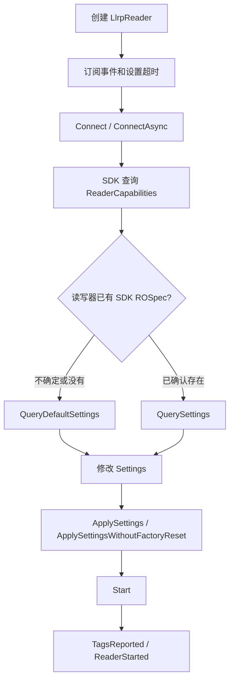
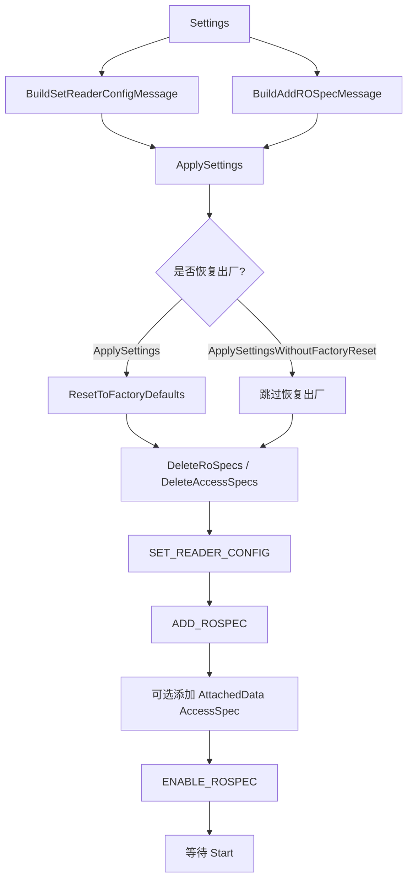
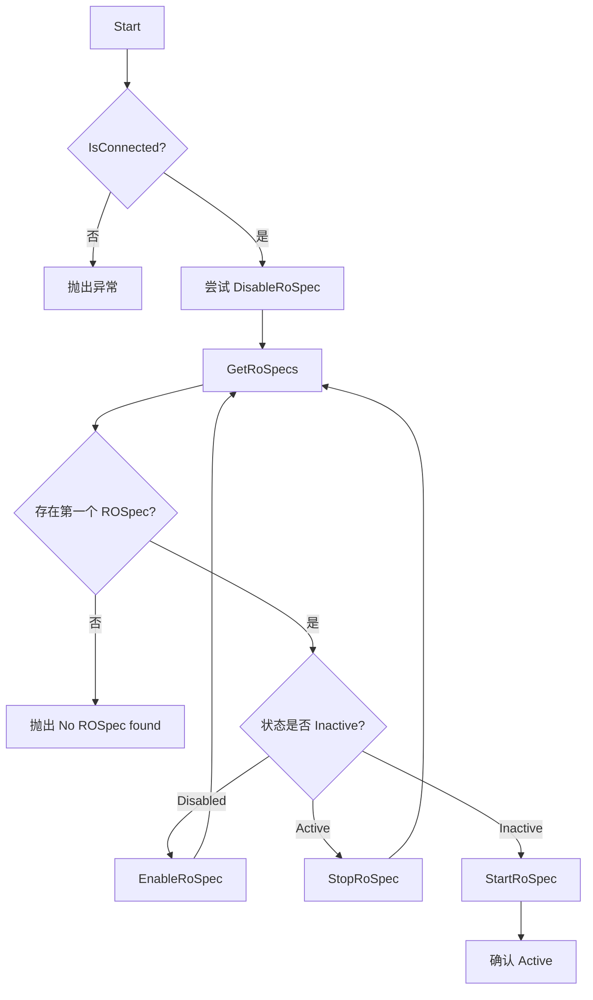

# LLRPSdk 开发文档

## 1. 概述
`LLRPSdk` 是本仓库面向 LLRP 1.0.1 RFID 读写器封装的 .NET SDK，目标框架为 `net9.0`。SDK 以 `LlrpReader` 作为主要入口，在 `LTKNet\LLRP` 协议库之上提供连接、配置、盘点、标签访问、GPIO、事件与诊断日志能力。

本仓库的典型层次如下：

- `LTKNet\LLRP`：LLRP 消息模型、编解码与 TCP/TLS 通信基础。
- `LLRPSdk`：对标准 LLRP 能力进行面向业务的封装，不要求调用方直接操作 LTKNet 消息。
- `LLRPReaderUI_WPF` / `LLRPReaderUI_Avalonia` / `LLRPReaderManagement`：基于 SDK 的 UI 与管理示例。

当前 SDK 聚焦标准 LLRP 报文能力，项目 README 中已记录联调过 Impinj R700、Zebra FX9600。不同厂商读写器的 LLRP 支持细节可能不同，开发时应优先通过 `ReaderCapabilities` 做能力判断。

## 2. 项目引用与依赖
`LLRPSdk.csproj` 引用本仓库内的 `..\LTKNet\LLRP\LLRP-LTKNet.csproj`。应用项目可以直接引用 `LLRPSdk` 项目，也可以引用编译后的 `LLRPSdk.dll` 与相关依赖。

```xml
<ProjectReference Include="..\LTKNet\LLRP\LLRP-LTKNet.csproj" />
```

基础使用命名空间：

```csharp
using LLRPSdk;
```

默认端口约定：

- 非 TLS：`5084`
- TLS：`5085`
- `Connect(address, useTLS)` / `ConnectAsync(address, useTLS)` 会按 `useTLS` 自动选择默认端口。

## 3. LlrpReader 生命周期
### 3.1 创建与连接
`LlrpReader` 支持无参构造，也支持 `LlrpReader(string address, string name)`。`Address` 是只读属性，通常由 `Connect(...)` 传入地址后设置。

```csharp
var reader = new LlrpReader
{
    ConnectTimeout = 5000,
    MessageTimeout = 5000,
    MaxConnectionAttempts = 1,
    LlrpMessageLogAsXml = false
};

reader.Connect("192.168.1.100");
```

常用连接方法：

- `Connect()`：使用实例中已有地址。
- `Connect(string address)`：连接默认非 TLS 端口 `5084`。
- `Connect(string address, int port)`：连接指定非 TLS 端口。
- `Connect(string address, bool useTLS)`：按 TLS 开关选择 `5084` 或 `5085`。
- `Connect(string address, int port, bool useTLS)`：连接指定端口并指定是否启用 TLS。
- `Connect(string address, int port, bool useTLS, TlsProtocols tlsProtocol)`：指定 TLS 协议版本。
- `ConnectAsync(...)`：异步连接，结果通过 `ConnectAsyncComplete` 返回。

连接成功后 SDK 会查询并填充 `ReaderCapabilities`。注意：`Connect()` 只建立连接并查询能力集，不会自动创建 ROSpec，也不会自动下发盘点配置。`Start()` 依赖读写器上已经存在的 SDK ROSpec；如果读写器刚恢复出厂、被 `ClearSettings()` 清空、或从未通过本 SDK 下发配置，直接调用 `Start()` 会因为找不到 ROSpec 而失败。

推荐的首次初始化流程是：连接成功后先调用 `QueryDefaultSettings()` 获取 SDK 根据 `ReaderCapabilities` 构造的默认配置，修改业务参数后调用 `ApplySettings(settings)`。`ApplySettings` 内部会执行 `SET_READER_CONFIG`、`ADD_ROSPEC`，并 `ENABLE_ROSPEC`，之后再调用 `Start()`。



最小可运行初始化示例：

```csharp
reader.Connect("192.168.1.100");

var settings = reader.QueryDefaultSettings();
settings.Report.Mode = ReportMode.Individual;
settings.Report.IncludeAntennaPortNumber = true;
settings.Report.IncludePeakRssi = true;

reader.ApplySettings(settings);
reader.Start();
```

如果你要读取并沿用读写器上已有配置，可以调用 `QuerySettings()`，但它要求读写器上已经存在符合 SDK 预期的 ROSpec。全新设备或清空配置后的设备不应从 `QuerySettings()` 起步，应从 `QueryDefaultSettings()` 或 `ApplyDefaultSettings()` 起步。

### 3.2 配置与 ROSpec 生命周期
SDK 将 `Settings` 拆成两类 LLRP 配置下发：

- `BuildSetReaderConfigMessage(settings)`：生成读写器配置，例如 Keepalive、GPIO、事件通知等。
- `BuildAddROSpecMessage(settings)`：生成 SDK 的固定 ROSpec，ROSpec ID 为 SDK 内部常量。
- `ApplySettings(settings)`：恢复出厂配置、删除旧 ROSpec 和 AccessSpec、下发 ReaderConfig、添加 ROSpec、按需添加附加数据 AccessSpec、启用 ROSpec。
- `ApplySettingsWithoutFactoryReset(settings)`：流程类似，但不先恢复出厂配置，适合 UI 中保留部分现场状态。



`Start()` 的职责只是启动已经存在的 ROSpec，不负责创建 ROSpec：



### 3.3 断开
- `Disconnect()`：正常断开，会发送 LLRP `CLOSE_CONNECTION`。
- `ForceDisconnect()`：网络异常、心跳超时或连接状态不可信时使用，不依赖读写器正常响应。

建议在 `KeepaliveTimeout` 中调用 `ForceDisconnect()`，避免在链路已不可用时等待关闭报文。

```csharp
reader.KeepaliveTimeout += r => r.ForceDisconnect();
```

### 3.4 状态方法
- `IsConnected`：当前连接状态。
- `QueryStatus()`：查询连接、盘点等状态快照。
- `QuerySingulatingState()`：查询当前是否处于盘点状态。
- `QueryTags()` / `QueryTags(double seconds)`：在等待拉取报告的模式下获取标签报告。

## 4. 核心类型
### 4.1 FeatureSet
`FeatureSet` 表示读写器能力集。常用字段：

- 设备信息：`ModelNumber`、`ReaderModel`、`FirmwareVersion`、`DeviceManufacturerNumber`
- 端口数量：`AntennaCount`、`GpiCount`、`GpoCount`
- 区域与射频：`CommunicationsStandard`、`CountryCode`、`IsHoppingRegion`、`TxPowers`、`RxSensitivities`、`TxFrequencies`、`HopTables`、`RfModes`
- 标签访问：`IsTagAccessAvailable`、`IsFilteringAvailable`、`MaxTagSelectFiltersAllowed`
- 高级能力：`IsMultiwordBlockWriteAvailable`、`IsMultiwordBlockEraseAvailable`、`CanDoTagInventoryStateAwareSingulation`

示例：

```csharp
FeatureSet caps = reader.ReaderCapabilities;
Console.WriteLine($"Model={caps.ReaderModel}, Firmware={caps.FirmwareVersion}");
Console.WriteLine($"Antennas={caps.AntennaCount}, GPI={caps.GpiCount}, GPO={caps.GpoCount}");
```

### 4.2 Settings
`Settings` 表示读写器配置。常用字段：

- `Keepalives`：心跳开关与周期。
- `AutoStart` / `AutoStop`：ROSpec 自动启动/停止配置。
- `Session`、`TagPopulationEstimate`：盘点会话与标签数量估计。
- `RfMode`、`HopTableId`、`ChannelIndex`、`TxFrequenciesInMhz`：射频模式与频点配置。
- `InventoryStateAware`、`InventoryTarget`、`InventorySearchMode`：状态感知盘点策略。
- `Filters`：标签过滤配置。
- `Report`：标签报告字段与报告模式。
- `Antennas`：天线启用、发射功率、接收灵敏度。
- `Gpis` / `Gpos`：GPIO 配置。
- `AttachedData`：盘点时附加读取数据的配置。

首次配置建议从 `QueryDefaultSettings()` 起步；只有确认读写器已经存在 SDK 下发的 ROSpec 时，才用 `QuerySettings()` 读取现场配置再修改。

```csharp
var settings = reader.QueryDefaultSettings();
settings.Keepalives.Enabled = true;
settings.Keepalives.PeriodInMs = 5000;
settings.Session = 2;
settings.TagPopulationEstimate = 32;
settings.Report.Mode = ReportMode.Individual;
settings.Report.IncludeAntennaPortNumber = true;
settings.Report.IncludePeakRssi = true;

var antenna1 = settings.Antennas.GetAntenna(1);
antenna1.IsEnabled = true;
antenna1.MaxTxPower = false;
antenna1.TxPowerInDbm = 30;
antenna1.MaxRxSensitivity = false;
antenna1.RxSensitivityInDbm = -70;

reader.ApplySettings(settings);
```

配置相关方法：

- `QuerySettings()`：读取当前配置；要求读写器已经存在 SDK 可解析的 ROSpec。
- `QueryDefaultSettings()`：读取 SDK 根据能力集构造的默认配置，不依赖读写器上已有 ROSpec。
- `ApplySettings(settings)`：先执行必要清理/重置，再应用配置。
- `ApplySettingsWithoutFactoryReset(settings)`：不恢复出厂配置，直接应用配置；UI 项目中用于保留更多现场状态。
- `ApplyDefaultSettings()`：构造默认配置并下发 ReaderConfig + ROSpec。
- `ResetToFactoryDefaultsOnly()`：仅请求读写器恢复出厂配置；之后通常需要再 `ApplySettings()`，否则没有 SDK ROSpec 可供 `Start()` 使用。
- `ClearSettings()`：旧接口，清理读写器配置后也需要重新下发 ROSpec。
- `SaveSettings()`：当前实现抛出 `NotSupportedException`，不要作为持久化入口使用。

### 4.3 Tag、TagReport
`TagsReported` 事件返回 `TagReport`，其中 `Tags` 是标签列表。`Tag.Epc` 类型为 `TagData`，输出字符串时建议使用 `ToHexString()` 或 `ToHexWordString()`。

只有在 `Settings.Report` 中启用对应字段后，标签对象中的天线、RSSI、时间戳、通道等字段才可靠。可通过 `IsAntennaPortNumberPresent`、`IsPeakRssiPresent` 等布尔字段判断。

```csharp
reader.TagsReported += (_, report) =>
{
    foreach (var tag in report.Tags)
    {
        var epc = tag.Epc.ToHexString();
        var antenna = tag.IsAntennaPortNumberPresent ? tag.AntennaPortNumber.ToString() : "-";
        var rssi = tag.IsPeakRssiPresent ? tag.PeakRssi.ToString("F1") : "-";
        Console.WriteLine($"EPC={epc}, Antenna={antenna}, RSSI={rssi}");
    }
};
```

### 4.4 TagData
`TagData` 用于表示标签内存中的 16 位字数据。常用方法：

- `TagData.FromHexString("00000000")`
- `TagData.FromWord(ushort value)`
- `TagData.FromWordArray(ushort[] data)`
- `TagData.FromByteArray(byte[] data)`
- `ToHexString()`、`ToHexWordString()`、`ToList()`、`ToUnsignedInt()`

注意：`FromHexString` 会去掉空格和连字符，并按 16 位字补齐。写标签数据时建议传入 4 个十六进制字符的整数倍，避免补齐导致写入内容与预期不一致。

### 4.5 TagOpSequence
标签访问操作通过 `TagOpSequence` 组织，添加到读写器后必须调用 `Start()` 才会执行。常用字段：

- `Id`：序列 ID，构造时自动生成。
- `ExecutionCount`：执行次数；`0` 表示不自动删除。
- `TargetTag`：目标标签匹配条件。
- `AntennaId`：指定天线，`AntennaIds.All` 或 `0` 表示所有天线。
- `State`：通常使用 `SequenceState.Active`。
- `Ops`：操作列表，例如 `TagReadOp`、`TagWriteOp`、`TagBlockEraseOp`、`TagLockOp`、`TagKillOp`。
- `BlockWriteEnabled`：写入时是否尝试使用 BlockWrite，需结合 `ReaderCapabilities.IsMultiwordBlockWriteAvailable` 判断。

`TargetTag` 常见写法：匹配 EPC 时 `MemoryBank = MemoryBank.Epc`，`BitPointer = 32`，因为 EPC Bank 的前两个 word 是 CRC 和 PC；匹配 TID 时通常从 `BitPointer = 0` 开始。

## 5. 事件与日志
常用事件：

- `ConnectAsyncComplete`：异步连接完成。
- `TagsReported`：标签盘点报告。
- `ReaderStarted` / `ReaderStopped`：读写器盘点状态变化。
- `TagOpComplete`：标签访问操作结果。
- `KeepaliveReceived` / `KeepaliveTimeout`：心跳接收与超时。
- `GpiChanged`、`AntennaChanged`、`AntennaStarted`、`EndOfCycle`：读写器事件通知。
- `ReportBufferWarning` / `ReportBufferOverflow`：报告缓冲区告警。
- `DiagnosticsReported`：诊断报告。
- `ErrorNotification`：底层异常通知。
- `RawFrameReceived` / `RawFrameSent`：原始 LLRP 帧。
- `LlrpMessageLogged`：LLRP 消息日志，可通过 `LlrpMessageLogAsXml` 控制是否输出 XML。

日志示例：

```csharp
reader.RawFrameSent += (_, raw) => Console.WriteLine($"TX {raw.Length} bytes");
reader.RawFrameReceived += (_, raw) => Console.WriteLine($"RX {raw.Length} bytes");
reader.LlrpMessageLogged += (_, message) => Console.WriteLine(message);
reader.ErrorNotification += (_, ex) => Console.Error.WriteLine(ex.Message);
```

## 6. 盘点开发流程
### 6.1 实时上报
```csharp
using LLRPSdk;

var reader = new LlrpReader();
reader.TagsReported += (_, report) =>
{
    foreach (var tag in report.Tags)
        Console.WriteLine(tag.Epc.ToHexString());
};
reader.KeepaliveTimeout += r => r.ForceDisconnect();

reader.Connect("192.168.1.100");

var settings = reader.QueryDefaultSettings();
settings.Report.Mode = ReportMode.Individual;
settings.Report.IncludeAntennaPortNumber = true;
settings.Report.IncludePeakRssi = true;
reader.ApplySettings(settings);

reader.Start();
Thread.Sleep(3000);
reader.Stop();
reader.Disconnect();
```

### 6.2 拉取报告
```csharp
using LLRPSdk;

var reader = new LlrpReader();
reader.TagsReported += (_, report) =>
{
    foreach (var tag in report.Tags)
        Console.WriteLine(tag.Epc.ToHexString());
};

reader.Connect("192.168.1.100");

var settings = reader.QueryDefaultSettings();
settings.Report.Mode = ReportMode.WaitForQuery;
reader.ApplySettings(settings);

reader.Start();
Thread.Sleep(2000);
reader.QueryTags();
reader.Stop();
reader.Disconnect();
```

`ReportMode.BatchAfterStop` 可用于停止后批量上报；`ReportMode.Individual` 适合 UI 实时刷新；`ReportMode.WaitForQuery` 适合由上位机主动拉取。

## 7. 标签访问流程
标签访问建议串行化处理：停止盘点、清理旧序列、添加新序列、启动、等待 `TagOpComplete`、停止、按需恢复原配置或附加数据访问序列。UI 项目中的读写页面也采用了这个流程。

### 7.1 读 TID、写 User
```csharp
using LLRPSdk;

var reader = new LlrpReader();
uint? currentSequenceId = null;

reader.TagOpComplete += (_, report) =>
{
    foreach (var result in report.Results)
    {
        if (currentSequenceId.HasValue && result.SequenceId != currentSequenceId.Value)
            continue;

        if (result is TagReadOpResult read)
            Console.WriteLine($"Read={read.Result}, Data={read.Data?.ToHexString()}");
        else if (result is TagWriteOpResult write)
            Console.WriteLine($"Write={write.Result}, Words={write.NumWordsWritten}");
    }
};

reader.Connect("192.168.1.100");
reader.Stop();
reader.DeleteAllOpSequences();

var sequence = new TagOpSequence
{
    ExecutionCount = 1,
    TargetTag = new TargetTag
    {
        MemoryBank = MemoryBank.Epc,
        BitPointer = 32,
        Data = "300833B2DDD9014000000000"
    },
    AntennaId = AntennaIds.All,
    State = SequenceState.Active
};

sequence.Ops.Add(new TagReadOp
{
    MemoryBank = MemoryBank.Tid,
    WordPointer = 0,
    WordCount = 6,
    AccessPassword = TagData.FromHexString("00000000")
});

sequence.Ops.Add(new TagWriteOp
{
    MemoryBank = MemoryBank.User,
    WordPointer = 0,
    Data = TagData.FromHexString("11223344"),
    AccessPassword = TagData.FromHexString("00000000")
});

reader.AddOpSequence(sequence);
currentSequenceId = sequence.Id;
reader.Start();

Thread.Sleep(2000);
reader.Stop();
reader.DeleteOpSequence(sequence.Id);
reader.Disconnect();
```

### 7.2 BlockWrite
```csharp
var caps = reader.ReaderCapabilities;
var sequence = new TagOpSequence
{
    ExecutionCount = 1,
    TargetTag = new TargetTag { MemoryBank = MemoryBank.Epc, BitPointer = 32, Data = targetEpc },
    AntennaId = AntennaIds.All,
    State = SequenceState.Active,
    BlockWriteEnabled = caps.IsMultiwordBlockWriteAvailable
};

sequence.Ops.Add(new TagWriteOp
{
    MemoryBank = MemoryBank.User,
    WordPointer = 0,
    Data = TagData.FromHexString("1122334455667788"),
    AccessPassword = TagData.FromHexString("00000000")
});
```

### 7.3 BlockErase
```csharp
if (!reader.ReaderCapabilities.IsMultiwordBlockEraseAvailable)
    throw new NotSupportedException("The reader does not report BlockErase support.");

var eraseOp = new TagBlockEraseOp
{
    MemoryBank = MemoryBank.User,
    WordPointer = 0,
    WordCount = 4,
    AccessPassword = TagData.FromHexString("00000000")
};
```

### 7.4 Lock
```csharp
var lockOp = new TagLockOp
{
    AccessPassword = TagData.FromHexString("00000000"),
    UserLockType = TagLockState.Lock
};
```

`TagLockState` 可用于 Kill Password、Access Password、EPC、TID、User。锁定和永久锁定会影响后续标签维护，生产环境必须确认目标标签和密码。

### 7.5 Kill
```csharp
var killOp = new TagKillOp
{
    KillPassword = TagData.FromHexString("12345678")
};
```

Kill 操作会永久停用标签，必须确保 Kill Password 已正确写入 Reserved Bank，且目标过滤条件唯一、准确。

## 8. GPIO
GPIO 能力取决于读写器。连接后可从 `ReaderCapabilities.GpiCount`、`ReaderCapabilities.GpoCount` 判断数量。

- GPI：通过 `Settings.Gpis` 配置，事件通过 `GpiChanged` 接收。
- GPO：可通过 `Settings.Gpos` 配置，也可使用 `SetGpo(ushort port, bool state)` 设置输出状态。

```csharp
reader.GpiChanged += (_, e) => Console.WriteLine($"GPI {e.PortNumber}: {e.State}");
reader.SetGpo(1, true);
```

## 9. 异常处理建议
- 所有连接、配置、盘点、标签访问调用都应捕获 `Exception` 或更具体的 `LLRPSdkException`。
- 读写器连接断开后，不要继续调用配置或盘点方法；先判断 `IsConnected`。
- `KeepaliveTimeout`、网络异常、读写器重启后，优先 `ForceDisconnect()` 并重新创建或重新连接。
- 标签访问和盘点不要并发启动；建议在应用层用状态机或锁串行化。
- 对 `TagOpComplete` 结果按 `SequenceId` 过滤，避免处理到旧序列或其他页面发起的操作。

## 10. 与 UI 项目的对应关系
可参考本仓库 UI 项目的实际调用方式：

- WPF/Avalonia 的连接页：创建 `LlrpReader`、连接、查询 `Settings` 和 `FeatureSet`。
- 盘点页：订阅 `TagsReported`，调用 `Start()` / `Stop()`。
- 读写页：`Stop()`、`DeleteAllOpSequences()`、构造 `TagOpSequence`、`AddOpSequence()`、`Start()`，再在 `TagOpComplete` 中处理 `TagReadOpResult` / `TagWriteOpResult`。
- 高级操作页：同样使用 `TagOpSequence` 执行 `TagBlockEraseOp`、`TagLockOp`、`TagKillOp`。
- 日志页：订阅原始帧和 LLRP 消息日志事件。

## 11. 开发检查清单
- 连接成功后再访问 `ReaderCapabilities`。
- 首次应用射频、天线、报告配置前先 `QueryDefaultSettings()`；已有 SDK ROSpec 时可用 `QuerySettings()` 读取现场配置。
- 设置功率、频点、RF mode 时优先参考 `FeatureSet` 中的能力表。
- 标签写入数据使用 16 位 word 对齐的十六进制字符串。
- 写、锁、Kill 等操作必须设置准确的 `TargetTag`。
- 高级操作前检查读写器能力，例如 BlockWrite、BlockErase。
- 心跳超时后使用 `ForceDisconnect()`。
- UI 或服务层要串行化 Start/Stop/Access 操作。
