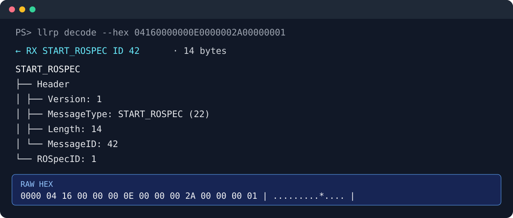

# LLRPClient

English | [简体中文](README.md)
> [!IMPORTANT]
>
> ## This project is no longer maintained
>
> `LLRPClient` has been discontinued and will no longer receive new features or bug fixes.
>
> Development has moved to the new **LLRPCSharp** repository:
>
> **➡️ [newton5555/LLRPCSharp](https://github.com/newton5555/LLRPCSharp)**
>
> LLRPCSharp provides a redesigned project structure, LLRP protocol support, a reader SDK, command-line tools, and improved cross-platform support.
>
> Please submit issues, feature requests, and pull requests in the new repository.


## LLRP CLI

`LLRP.Cli` is a cross-platform command-line tool for debugging and automating standards-compliant LLRP readers. Use it as an interactive REPL or invoke one-shot monitoring and frame-decoding commands from scripts or CI. It renders an LLRP message tree, Message ID, status and the complete raw hexadecimal frame to make protocol-level troubleshooting practical.

```powershell
# Publish and run the CLI executable directly
dotnet publish LLRP.Cli -c Release -o .\publish\llrp
.\publish\llrp\LLRP.Cli.exe

# Or launch it directly from the project while developing
dotnet run --project LLRP.Cli

# Decode a captured LLRP frame without connecting to a reader
dotnet run --project LLRP.Cli -- decode --hex 04160000000E0000002A00000001
```

### Decode output

The CLI decodes a `START_ROSPEC` frame into a semantic tree while retaining its complete Hex payload:



The tool supports TLS connections, reader capabilities/configuration queries, ROSpec creation and lifecycle management, continuous frame monitoring and offline frame decoding. State-changing operations require confirmation in the interactive console. See [LLRP.Cli/README.md](LLRP.Cli/README.md) for the full command reference and publishing instructions.

## 1. Introduction to LLRP

LLRP (Low Level Reader Protocol) is a standard communication interface between RFID readers and host computer clients defined by GS1 EPCglobal. It is called "low level" because it provides fine-grained control over RFID air interface protocol timing, reader behavior, and tag operation parameters, making it suitable for application scenarios that require direct management of reader capabilities, antennas, inventory processes, and tag commands.

This project implements reader connection, configuration, and tag operation capabilities around the LLRP protocol, and can be used to interface with LLRP-enabled RFID devices.

## 2. Standard Versions

### 2.1 LLRP 2.0

The current publicly available LLRP standard version from GS1 is 2.0, released in January 2021. This version is designed to better match the Gen2v2 air interface standard and introduces version management, backward compatibility, and extensions related to privacy and security.

- Standard introduction page: https://www.gs1.org/standards/epc-rfid/epc-rfid-llrp/2-0
- Current standard PDF: https://www.gs1.org/docs/epc/LLRP_standard_i2_r_2021-01-27.pdf

### 2.2 LLRP 1.0.1

LLRP 1.0.1 is an earlier version widely supported by device manufacturers, and many existing RFID readers and SDKs still implement protocol interactions based on this version.

- 1.0.1 Standard PDF: https://gs1go2.azureedge.net/sites/gs1/files/docs/epc/llrp_1_0_1-standard-20070813.pdf

This project uses LLRP version 1.0.1.

## 3. LLRP ToolKit

LLRP ToolKit, commonly abbreviated as LTK, is a collection of open-source tool libraries built around the LLRP protocol. It is primarily designed to help developers with basic tasks such as LLRP message definition, encoding/decoding, sending/receiving communications, and object model mapping. For scenarios requiring RFID reader integration, development of debugging tools, or implementation of host control software, LTK can significantly reduce the cost of protocol integration.

From a historical implementation perspective, official and community resources for LTK mainly focus on LLRP 1.0.1, so many existing projects, sample code, and reader manufacturer implementations are still based on the 1.0.1 framework.

### 3.1 Related Resources

- Official site: http://llrp.org/
- SourceForge project page: https://sourceforge.net/projects/llrp-toolkit
- GitHub mirror of the original CVS project: https://github.com/opencps/llrp-toolkit

### 3.2 Impinj-maintained LTKNet Extended Version

Impinj provides a .NET version based on the extended original LTKNet, adding IPv6 and TLS encrypted communication support, making it more suitable for LLRP application development and device communication integration in modern .NET environments. The official Impinj LTKNet typically consists of two parts: standard LLRP message capabilities and vendor-specific message extensions, corresponding to the common assemblies LLRP.dll and LLRP.Impinj.dll.

- NuGet package: https://www.nuget.org/packages/libltknet-sdk/

## 4. Project Description

This repository is encapsulated based on Impinj's LTKNet approach, focusing on standard LLRP protocol capabilities, and the code is organized as "protocol library + UI examples":

- LTKNet-Impinj: A copy of the standard LTK (LTKNet) maintained by Impinj.
- LLRPSdk: Implemented with reference to OctaneSdk, removing calls to LLRP.Impinj.dll and retaining only standard LLRP message capabilities; primarily provides functionality through LLRPSdk.LlrpReader.
- LLRPReaderUI_WPF / LLRPReaderUI_Avalonia: Upper-level UI and example projects.

## 5. UI Projects

LLRPReaderUI_WPF is a visual demo based on standard LLRP messages, which can be used to verify common operation workflows such as connecting to readers, inventorying tags, and reading/writing tag memory.

The following devices have been tested and verified:

- Impinj R700
- Zebra FX9600
